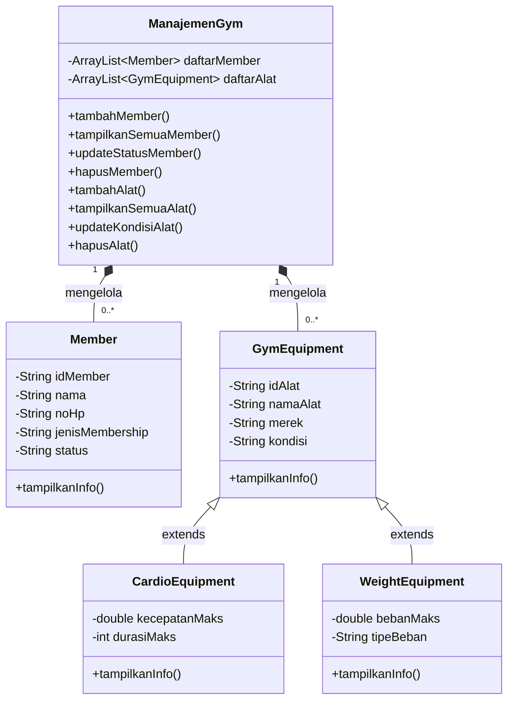

# Sistem Manajemen Gym 

## Identitas Mahasiswa
- **Nama:** Kenny Giovanni Gavra
- **NIM:** 2509116003
- **Mata Kuliah:** Pemrograman Berbasis Objek
- **Kelas:** A 2025

---

## Studi Kasus

Program ini merupakan implementasi **CRUD (Create, Read, Update, Delete)** dengan konsep **Object-Oriented Programming (OOP)** dalam bahasa Java, dengan studi kasus **Sistem Manajemen Gym**.

Latar belakang studi kasus: sebuah gym membutuhkan sistem sederhana untuk mengelola dua jenis data utama, yaitu:

1. **Data Member** — anggota gym beserta status keanggotaannya (jenis membership, status aktif/tidak aktif, dll).
2. **Data Alat Gym** — inventaris alat olahraga yang dimiliki gym, yang terbagi menjadi dua kategori:
   - **Alat Cardio** (contoh: treadmill, sepeda statis) — punya atribut khusus seperti kecepatan maksimal dan durasi maksimal pemakaian.
   - **Alat Beban** (contoh: dumbbell, barbel, mesin beban) — punya atribut khusus seperti beban maksimal dan tipe beban.

Karena alat cardio dan alat beban sama-sama merupakan "alat gym" namun memiliki karakteristik yang berbeda, studi kasus ini cocok diimplementasikan menggunakan konsep **inheritance (pewarisan)**, di mana keduanya mewarisi atribut umum dari satu induk class yang sama.

---

## Hierarki Class



### Penjelasan Hierarki

| Class | Peran |
|---|---|
| `Member` | Menyimpan data anggota gym (berdiri sendiri, tidak ada relasi inheritance) |
| `GymEquipment` | **Parent/superclass**, menyimpan atribut umum yang dimiliki semua alat gym |
| `CardioEquipment` | **Subclass** dari `GymEquipment`, khusus alat cardio |
| `WeightEquipment` | **Subclass** dari `GymEquipment`, khusus alat beban |
| `ManajemenGym` | Class manager, menyimpan `ArrayList` dari `Member` dan `GymEquipment`, berisi seluruh logic CRUD |

### Struktur Package

```
src/
├── Main.java                    (default package)
├── data_gym/
│   ├── Member.java
│   ├── GymEquipment.java
│   ├── CardioEquipment.java
│   └── WeightEquipment.java
└── operasional/
    └── ManajemenGym.java
```

---

## Penerapan Inheritance dalam Kode

Konsep inheritance diterapkan pada relasi antara `GymEquipment` (Super Class) dengan `CardioEquipment` dan `WeightEquipment` (Sub Class)

### 1. Super Class — `GymEquipment`

Menyimpan atribut yang dibutuhkan oleh **semua** jenis alat gym, agar tidak perlu ditulis ulang di tiap subclass:

```java
public class GymEquipment {
    private String idAlat;
    private String namaAlat;
    private String merek;
    private String kondisi;

    public GymEquipment(String idAlat, String namaAlat, String merek, String kondisi) {
        this.idAlat = idAlat;
        this.namaAlat = namaAlat;
        this.merek = merek;
        this.kondisi = kondisi;
    }

    public void tampilkanInfo() {
        System.out.println("ID: " + idAlat + " | Nama: " + namaAlat + " | Tipe: Umum");
    }
}
```

### 2. Sub Class — `CardioEquipment extends GymEquipment`

Kata kunci **`extends`** menandakan bahwa `CardioEquipment` mewarisi seluruh atribut dan method dari `GymEquipment`, lalu menambahkan atribut khusus (`kecepatanMaks`, `durasiMaks`):

```java
public class CardioEquipment extends GymEquipment {
    private double kecepatanMaks;
    private int durasiMaks;

    public CardioEquipment(String idAlat, String namaAlat, String merek, String kondisi,
                            double kecepatanMaks, int durasiMaks) {
        super(idAlat, namaAlat, merek, kondisi); // memanggil constructor parent
        this.kecepatanMaks = kecepatanMaks;
        this.durasiMaks = durasiMaks;
    }

    @Override
    public void tampilkanInfo() {
        System.out.println("... Tipe: Cardio | Kecepatan Maks: " + kecepatanMaks + " km/jam");
    }
}
```

---

## Cara Menjalankan Program

```bash
javac data_gym/*.java operasional/*.java Main.java
java Main
```

Atau jika menggunakan IDE (NetBeans/Eclipse/IntelliJ), cukup jalankan (Run) file `Main.java`.

---

## Tangkapan Layar Program Berjalan

**Tampilan Menu Utama:**


**Tampilan Menu Kelola Member:**


**Tampilan Menu Kelola Alat Gym:**


